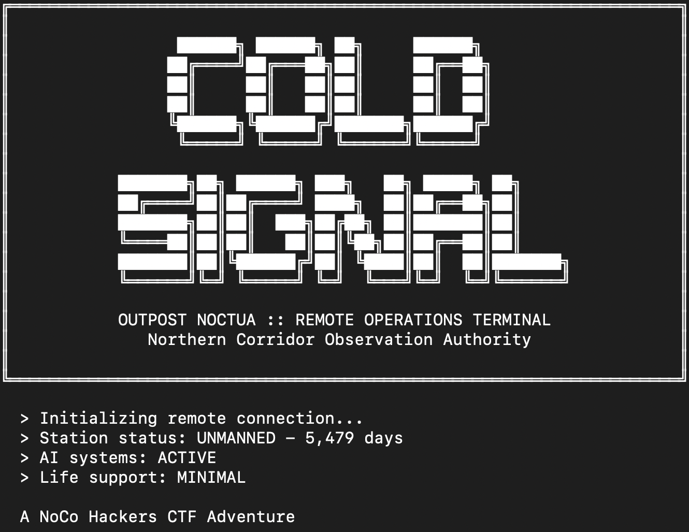

# Intro

This is year two of building custom CTF challenges for [NoCo Hackers](https://www.meetup.com/noco-hackers/), our local security meetup in Fort Collins. Last year I built [Horsetooth Liquidators](/posts/horsetooth-ctf/) -- a vulnerable e-commerce web app with eight challenges. This year I wanted to try something completely different.

**Cold Signal** is a text adventure CTF. Players SSH into an abandoned research station and find flags by exploiting vulnerabilities embedded in the game itself. No browser. No web forms. Just a terminal and a mystery. You can [try it in your browser here](https://georgetipton.com/cold-signal).

<video autoplay loop muted playsinline style="width:100%; border-radius:8px;">
  <source src="images/broadcast-783.webm" type="video/webm">
</video>

# Making CTFs Fun (and Where That Gets Complicated)

I grew up on video games. Before always-online consoles, there were GameSharks and Action Replays -- plug a cartridge into a device, modify some memory values, and suddenly you could walk through walls. That was probably my first real exposure to the idea that systems have rules, and if you understand how they work underneath, you can break them.

I think a lot of security people got their start the same way. Not from a textbook. From play. From poking at something just to see what happens. Game cheats and exploits share the same DNA.

So when I attended the LASCON CTF in Austin in 2025 and saw what [Johnny Reina](https://github.com/jreina) had built -- a badge game with [IRC bots](https://github.com/jreina/lascon-badge-game-2025-irc-bots) that had distinct personalities across channels, a [fake corporate website](https://github.com/jreina/lascon-badge-game-2025-the-corp) to investigate, and a world that was genuinely fun to poke around in -- it clicked. CTFs don't have to feel like security homework. They can be _experiences_.

I wanted to push that further. I've always been fascinated by text adventures -- Zork, Colossal Cave Adventure -- the idea that you can build real atmosphere with nothing but words on a screen. So I built Cold Signal: an abandoned research station, a crew that vanished under weird circumstances, an AI that's helpful but clearly hiding something.

<!-- TODO: Add nethack.png to images/inspiration/ -->



The challenges were simulations of real vulnerability classes -- session fixation, path traversal, configuration manipulation -- baked into the game world. I also hid a flag in the spectrogram of the landing page's background audio for a steganography challenge outside the game.

There's [real research](https://www.emerald.com/insight/content/doi/10.1108/jarhe-02-2024-0072/full/html) backing up the gamification approach -- gamified security education [consistently outperforms traditional methods](https://www.researchgate.net/publication/378541770_Leveraging_Gamification_and_Game-based_Learning_in_Cybersecurity_Education_Engaging_and_Inspiring_Non-Cyber_Students) for engagement and retention, especially for people without prior security backgrounds. The theory was solid.

# The reception was lukewarm.

Our meetup is still small -- maybe 10-20 people -- and the ones playing the most are experienced CTF players who are there to score points. For them, the narrative was decoration. A peer who also develops challenges said something that stuck with me: CTF challenges should seek to _teach_ people something. Cold Signal was built to have people _experience_ something. I didn't think about that distinction until it was too late.

Where it broke down:

- **Narrative as friction** -- Competitive players didn't want to read room descriptions or parse dialogue for hints. They wanted to find a vuln, exploit it, move on.
- **Unfamiliar mechanics** -- Save states and access levels make sense in a game. In a CTF, they just confused people.
- **Red herrings** -- I added an interactive access card as atmospheric flavor. Players saw a tangible item that matched their problem (need elevated access) and spent 20+ minutes trying to use it. The actual solution was loading a saved session. Classic game design tool. Terrible CTF design tool.
- **Wrong audience** -- I hoped to appeal to newer players who'd find a game more approachable than a challenge board. But I didn't market it that way, and the beginners I was designing for didn't show up.

<!-- TODO: Replace with Secret of Monkey Island red herring screenshot -->


_Red herrings work in adventure games. Not so much in CTFs._

Johnny's LASCON badge game found a better balance. His IRC bots had personalities and a narrative thread, but the underlying infrastructure was real -- players had to learn actual IRC commands, read protocol documentation, interact with real networked services. The story made it interesting. The technology made it educational. My game simulated everything inside a Python app, and that limited both the technical depth and the educational value.

I went too far toward narrative and not far enough toward teaching. Next time I'm starting with the challenges, building them around real-world CVEs and technologies, and using narrative as seasoning -- not the main course.

I also wish I'd leaned harder into the GameShark angle. That bridge between video game cheats and security exploits is intuitive and relatable, and I think it could genuinely reach people who game but haven't thought about security as a discipline.

# Building It with AI Agents

The other big experiment was the development process. Last year I used Cursor with Claude 3.5 Sonnet and ChatGPT. It worked, but I was constantly re-explaining context every time I switched between writing narrative, coding the engine, or setting up deployment. The AI forgot earlier decisions. I spent more time catching it up than building.

This year I used Claude Code with five specialized agents:

| Agent                     | Role                                                        |
| ------------------------- | ----------------------------------------------------------- |
| **ctf-narrative-agent**   | Story, atmosphere, room descriptions                        |
| **python-game-developer** | Game engine, command parser, Python architecture            |
| **challenge-designer**    | Vulnerability specs, difficulty tuning, hint systems        |
| **tech-stack-architect**  | Docker, SSH, session isolation, security review             |
| **project-coordinator**   | Task breakdown, agent coordination, cross-cutting decisions |

Each one maintained its own context. The narrative agent remembered the tone it set. The game developer knew the architecture. The challenge designer tracked difficulty across all three challenges. I could switch between domains without starting over.

Development went from about 65 hours to 42. But the bigger win was consistency -- the game's AI character always sounded the same because one agent wrote all her dialogue. The code stayed clean because one agent enforced the architecture. Security boundaries stayed clear because one agent specifically watched for that.

They weren't autopilot. When the narrative agent and challenge designer disagreed about hints -- more atmosphere vs. more clarity -- I made the call. When scope crept, I cut features. They're collaborators, not replacements. Domain expertise and execution come from the agents. Creative direction and prioritization come from me.

Going from "one AI that forgets everything" to "a team of specialists that each maintain their domain" was the biggest practical improvement in my workflow this year. I'd use this approach again for anything that crosses multiple domains.

# Where This Goes

Cold Signal was an experiment. Mixed results. The AI development workflow was a clear win. The narrative-heavy CTF format needs work.

But I still think there's something here. CTFs have come a long way since [DEF CON ran the first one in 1996](<https://en.wikipedia.org/wiki/Capture_the_flag_(cybersecurity)>). Attack-defense wargames, jeopardy-style platforms, [education-first formats](https://dl.acm.org/doi/10.1145/3626252.3630912) built for learners. Security education and game design are starting to overlap, and nobody's figured out the right formula yet:

- [Hacknet](https://store.steampowered.com/app/365450/Hacknet/) and [Grey Hack](https://store.steampowered.com/app/605230/Grey_Hack/) on Steam prove there's appetite for game-based security experiences
- [Hack The Box](https://www.hackthebox.com/) and [TryHackMe](https://tryhackme.com/) keep pushing toward more accessible, guided training
- [PicoCTF](https://picoctf.org/) shows that education-first CTFs can reach massive audiences
- Even [SANS Holiday Hack Challenge](https://www.sans.org/cyber-ranges/holiday-hack-challenge) -- after 10 years of narrative-driven CTF design -- added a CTF-only mode in 2025 so competitive players could skip the story entirely

AI tooling makes this kind of experimentation cheaper, too. Building a text adventure CTF, deploying it via Docker and SSH, iterating on player feedback -- solo -- would've been impractical a few years ago.

Next year's CTF starts with the challenges. Real technologies, real CVEs, narrative to tie them together. Find the middle ground between teaching and experiencing.

If you grew up on video games and ever wondered how cheat codes actually worked, you already have the instinct for security.

# Resources

- [Play Cold Signal in your browser](https://georgetipton.com/cold-signal)
- [Cold Signal GitHub Repository](https://github.com/Geo-Bit/cold-signal)
- [Horsetooth Liquidators (2024 CTF)](/posts/horsetooth-ctf/)
- [NoCo Hackers Meetup](https://www.meetup.com/noco-hackers/)
