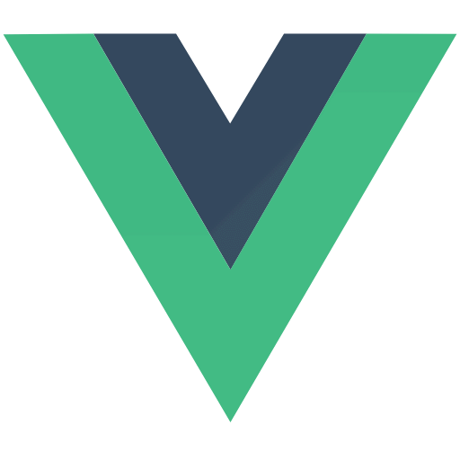

# Intro
The Horsetooth Liquidators project is something I put together as part of my involvement with NoCo Hackers, a local security meetup here in Fort Collins. We ran our capture the flag (CTF) event for the second time, and with a significantly bigger crowd, I thought it was a good chance to try building a custom vulnerable web application.

Having used apps like Juice Shop, DVMA, Gruyere, CRAPI, etc., I have always wanted to dive deeper into what it takes to develop something similar. Having benefited from CTFs myself, I wanted to give back by creating a platform that provides challenges, but is also fun, immersive, and thematic. The idea was to see what I could create over a couple of months, using the skills I've picked up from developing web applications over the past few years. I was also curious about how Gen AI tools like ChatGPT, Claude, and Cursor could assist in building larger projects.

We designed the event around a fictional Fort Collins business that needed a security check-up. Participants took on the role of security engineers, assessing the business's security and submitting flags in the CTF. It was all about crafting a unique experience for everyone involved.

<details>
  <summary>
    Here's the CTF narrative prompt we used for the event
  </summary>
  
  >Sly, a tired and overworked fox, was the lead developer and sysadmin at Horsetooth Liquidators Inc., a rapidly growing liquidation company in Fort Collins. When he first joined, he was excited about the challenge of building the company’s e-commerce platform from scratch. But as the company expanded, so did Sly’s responsibilities. With no extra help in the IT department, he was stretched thin, juggling new feature requests, server maintenance, and keeping the company’s web infrastructure running smoothly.

  >Over time, the system began to show cracks. Sly knew there were vulnerabilities he hadn’t had time to fix—SQL injections, outdated encryption, and exposed API endpoints. Each day he feared an attack was looming, but with every plea to the CEO, Mr. Badger, for more resources, he was met with the same response: “No budget for extra staff. Just keep things running, Sly.”

  >Sly did his best, patching what he could while trying to meet deadlines for new features. But the stress was catching up with him. His fur was frazzled, and he felt a sinking pit in his stomach whenever a new security alert popped up. Finally, after an especially close call when an attempted attack almost broke through, Sly had enough. He confronted Mr. Badger, insisting that the company needed help before a real disaster struck. After much grumbling and hand-wringing, Mr. Badger relented. “We’ll bring in a penetration tester,” Mr. Badger said. “But it better not cost too much.”

  >Enter Thumper, a sharp and resourceful rabbit from Briarwood Security, a well-known firm that specialized in uncovering vulnerabilities. Thumper had a reputation for being thorough, and he wasted no time setting up his tools. His mission was clear: test the infrastructure at Horsetooth Liquidators from top to bottom, identify every flaw, and recommend fixes.

  >Sly, feeling a mix of relief and nervousness, sat nearby, ready to assist but also anxious about what Thumper might uncover. He had done his best, but he knew there were gaps.

  >Thumper, calm but focused, ran his initial scans and began probing the system. The fate of the company's security now lay in the hands of the rabbit—and the vulnerabilities he was about to expose.

  >Now it’s your turn! As Thumper, the skilled penetration tester, you’ve been brought in to identify and exploit vulnerabilities in the company’s infrastructure. Your task is to expose these weaknesses before an actual attacker does. Can you uncover the flaws that Sly hasn’t been able to fix?
</details> 


Oh, and Horsetooth is in reference to the [Horsetooth Rock](https://www.coloradoan.com/story/life/2016/05/08/fleming-legend-horsetooth-rock/84124710/) (and Horsetooth Reservoir) here in Fort Collins, CO:


<hr>

# The Goal
At the end of the day, my goal was to create a fun and immersive web experience for CTF players, packed with a variety of challenges and flags. I wanted it to feel like a real business, Horsetooth Liquidators, and make it as thematic as possible. The first year we had a small turnout, so I focused on making the platform approachable and enjoyable for all skill levels. The challenges needed to be balanced - not too hard, but not too easy either. It would have been easy to recycle one of the many other vulnerable web app platforms, but I wanted to create something new and thematic specifically for our event.

Here's what I came up with:


<br>

<hr>

# Technical Architecture

## Tech Stack
I chose Vue 3 for the frontend, Express and Node for the backend, and PostgreSQL for the database. I primarily chose this stack since I had previous experience with it and it easily met the project requirements.

  
  
  
  
  
  


## Hosting
I went with Google Cloud for hosting as an opportunity to get more familiar with the GCP native services since most of my past experience has been with both Azure and AWS, but not so much GCP. For the project, I leveraged GCP Run Services, Google Cloud SQL, Google Cloud Storage, Google Cloud Functions, and Google Cloud Secret Manager. Docker was used for containerization to help make environment management more consistent across development and production. This is what the final GCP architecture looked like:


<figure>
  
  <figcaption>GCP Architecture</figcaption>
</figure>


## Security Considerations and Requirements:
- I didn't want to limit the tooling people could use for the CTF, so I had to design the infrastructure to be able to handle brute forcing tools like dirbuster and hydra as well as other tools like sqlmap and Burpsuite. Fortunately, I did not encounter any performance degradation or disruptions/outages, and the infrastructure scaled and held up well overall.
- Securing the flags from players was a challenge, which meant that I needed to prioritize adequate authentication/authorization between the frontend and backend. This included using validated JWT tokens as access tokens and secrets (stored in Google Cloud Secret Manager) to secure the backend endpoints. This held up well during the event and prevented users from abusing the backend to get flags. 

This is pretty much the auth pattern I used for flag retrieval:
```javascript
// Backend (Express)
import jsonwebtoken

// JWT secret generated during deployment
jwtSecret = environment.JWT_SECRET // $(openssl rand -base64 32)

// Middleware to verify JWT token
function verifyToken(request, response, next) {
    token = request.headers.authorization.split(' ')[1]
    
    if (token is empty) {
        return response.error(401, "No token provided")
    }
    
    // Verify token using JWT library
    result = jwt.verify(token, jwtSecret)
    if (result has error) {
        return response.error(401, "Invalid token")
    }
    
    // ... attach decoded token to request
    next()
}

// Protected flag route
function getFlagById(request, response) {
    challengeId = request.params.challengeId
    
    if (isChallengeCompleted(challengeId)) {
        flag = getFlag(challengeId)
        return response.success({ flag })
    } else {
        return response.error(403, "Access denied")
    }
}

// Register route with middleware
router.get('/api/flags/:challengeId', verifyToken, getFlagById)
```

```javascript
// Frontend (Vue)
// Function to retrieve the flag for a specific challenge
function getFlag(challengeId) {
    token = localStorage.get('token')
    
    try {
        response = apiCall.get('/api/flags/' + challengeId, {
            headers: {
                Authorization: 'Bearer ' + token
            }
        })
        // ... handle success response
    } catch (error) {
        // ... handle error response
    }
}
```
<hr>

# Flag Development & Philosophy

## Narrative & Challenge Progression
  I really wanted to craft a compelling narrative to maximize player engagement and enjoyment. Players assumed the role of a security engineer hired to assist a business, progressing through challenges that mirrored real-world scenarios. Using CTFd's challenge dependencies, my goal was to create a logical progression, but this limited the number of available challenges, affecting player motivation which I'll touch more later.

## Something for Everyone
  I aimed to create CTF challenges that would appeal to a wide range of skill levels. We had participants for whom this was their first CTF event, as well as veteran CTF players. My goal was to cater to everyone if possible. Ultimately, I had to make a decision to preioritize one or the other, which I'll touch on later in the Lessons Learned section.

## Something New
  I wanted to create challenges that were relevant to modern security practices, but also straightforward to solve. My hope was to include some modern CVE examples and dabble with AI/LLM vulnerabilities to provide something fresh to the player. Though since this CTF included brand new players with minimal web security experience, it was a good opportunity to sprinkle in some of the more basic OWASP Top 10 type challenges as well.

## Challenges
Ultimately, I ended up developing 8 web challenges:
  1. Backup Protocol (25pts) - CWE-312
  2. Admin Access Requires (75pts) - CWE-347
  3. Inventory Overflow (50pts) - CWE-20
  4. Rookie Mistake (25pts) - CWE-312
  5. Order Up! (50pts) - CWE-639
  6. Confused Fox (25pts) - CWE-74
  7. Late Night Easter Egg (25pts) - CWE-312
  8. Support Ticket Snooping (100pts) - CWE-79


You can find the full descriptions of challenges on the GitHub project at [horsetooth-liqudators/CHALLENGES.md](https://github.com/Geo-Bit/horsetooth-liquidators/blob/main/CHALLENGES.md).

<hr>

# How It Went...
A few thoughts on what went well and what could have gone better

## Building the Thing
### Tech Stack & Infra
Overall, everything was :thumbsup:, but a few things worth highlighting:
1. I had to pivot from originally having everything deployable with Docker Compose to building and serving individual images to Google Cloud Run. I also had to move away from deploying Postgres via Docker to using Google Cloud SQL, which was fine but required a bit more setup in GCP.
2. Quickly abandoned the VM route. For a moment, I was going to pivot to using IaaS/VMs so I could retain my Docker Compose setup, but I quickly realized how much of a pain reployment was going to be, and I'm glad I went serverless. 
3. Overall spend during 2-3 weeks of hosting was only ~$35 which isn't that bad for the number of services and user traffic received. I set up a budget alert to notify me if the spend exceeded $50 and was happy to see it never went over.

### Deployment
I never fully automated the deployments to Google Cloud, and I would have liked to. Fortunately I didn't have to deal with any major outages or bug fixes, so I wasn't ever overwhelmed with the re-deployment process. The GCP CLI tool made redeploying a breeze, so once I was able to test in dev using Docker Compose, I just ran the gcloud builds like:

```bash
# DEPLOY BACKEND
gcloud builds submit --config cloudbuild.yaml \
  --substitutions=_INSTANCE_CONNECTION_NAME="GCP_SQL_INSTANCE_NAME",\
_DB_USER="postgres",\
_DB_PASSWORD='SUPER_SECRET_PASSWORD',\
_DB_NAME="horsetooth_liquidators",\
_FRONTEND_URL="FRONTEND_URL",\
_JWT_SECRET="$(openssl rand -base64 32)"
```
```bash
# DEPLOY FRONTEND
gcloud builds submit --config cloudbuild.frontend.yaml  

```

### More Data 
I would have liked to invest more time into telemetry and observability data. I was very curious about how people were interacting using and evaluating the application. Google Cloud actually offers decent analytics, telemetry, and observability services (ie. Google Cloud Monitoring, Google Cloud Logging, and Google Cloud Trace). I would have liked to use these services to achieve better visibility and understanding of user interactions and behaviors during the CTF event but unfortunately this fell to the wayside.

One of the benefits of using a CTF hosting platform like CTFd, is that you do get decent metrics on solves, challenges, point distribution, and more. I spent a bit of time analyzing this data after the event, and was able to put together a few visuals like the Points vs. Solves chart below.

## Flag Development
### Validation and Security
I initially overlooked securing the flags from players. Midway through development, I moved all flag delivery to the backend, making them inaccessible from the frontend. Browser features like the developer console can easily detect hard-coded flags. The Chatbot had a bug with the drop-down prompts, which broke while I focused on the freeform text option. I had to push a hotfix to fix the issue, but fortunately this did not break any of the challenges themselves.

### Challenge Progression and Difficulty Curves
[](solves-points.png)
Looking at the correlation of # of points to % solved, I'm generally happy with the difficulty curve with the exception of Iventory Overflow, which no one solved unfortunately and was supposed to be more of a "Medium" difficulty challenge.
Unfortunately, this is the result of having a very specific expected solution method in mind, and not being flexible enough to allow for other strategies. I assumed users would leverage something like Burpsuite to enumerate the inventory endpoint and brute force inventory values. This proved to be more elusive than I had hoped, and led to players ultimately missing out on the challenge.

### Testing (oops)
Honestly, I completely dropped the ball on testing and developing test cases for challenges, which fortunately only led to 1-2 minor bugs. One challenge in particular involved cracking a password hash, and I was confident the hash could easily be cracked using a tool like Hashcat or John, but I was wrong. I ended up having to providing players with a custom password file to use, which significantly simplified the challenge and made it less fun. This could have be avoided if I would have tested the hash myself, but unfortunately I was short on time. In the future, I will definitely write unit tests for all of the challenges which actually would also be a fun challenge in itself.

### Next Time - More Modular!
Assuming I'm developing something brand new and not just forking this project, I want to take a more modular approach to the project and challenges. I would like develop a "shell" of an ecommerce web application, for example, and make each challenge a potentially added feature of the platform, but not have them be dependencies or related to one another. Ideally, I could develop something that I could continue to recycle and add on to each year. 

## AI Tooling - not perfect, but pretty damn good
This was by far the largest project I have developed using AI tooling. This was my first time using Cursor to help develop the majority of features, specifically using Claude 3.5 Sonnet. These AI models still have trouble keeping up with large code bases, and I ran  into several instances where the model would lose context and start deviating from the original prompt, so in the later stages of development, it could be a headache getting the model back on track and re-feeding it sufficient context to continue progressing. For specific re-occuring patterns and features, it would be super helpful to be able to define a "recipe" for the model to follow. Things as simple as the preferred flag generation pattern:

```python
python -c 'from secrets import token_hex; print(f"noco{{{token_hex(16)}}}")'
```

I noticed that because of the contextual limitations, it really requires the developer to be able to identify deviations and be familiar enough with web development (or general software development) to get the AI back on track. While the fixes typically involve clever prompting, I did have to revert to previous commits at times. 

When it came to generating flavor text for the web application and challenges, AI was extremely helpful. By feeding it the initial Horsetooth Liquidators story prompt, I had it build me the About Page, the Hiring Page, the Inbox messages, and the challenge descriptions with ease. This really helped speed up development and is what primarily allowed me to keep the challenges and narrative on-theme and engaging.

## Player Experience
We went from 3 users to over 15 users this year, which makes me tremendously proud and excited for future events. To me, the amount of participation and feedback reinforced the value of the event and the opportunity to learn and grow. 

I had several participants reach out to me with feedback and appreciation for the web app and challenges, which was super cool. I had a few instances of unexpected solutions and approahces which was also fun to see. One player accidentally completed the Support Ticket Snooping challenge while trying to solve the Inventory Overflow challenges which is awesome. Support Ticket Snooping was a XSS challenge that involved devising a payload that would expose an admin-panel iframe to the user. The CTF player was using Burpsuite which helped them identify the solution while also trying to brute force our inventory endpoint to find the flag. 

It's also worth noting that we leveraged our community Discord to host comms for the event. This live communication stream actually helped pull more players into the event, and gave players the opportunity to work with the development team, report issues, and more. We had a private channel for discussing challenge development as well, which helped with coordination.

# Conclusion
While I feel like I could have prioritized more time on designing the challenges themselves, I learned a lot about the value of hands-on security education. Unfortunately, because I spent so much time developing the platform, I didn't get to spend any time actually playing the CTF. But I'm a big fan of the "learn by doing" approach, and I think this CTF event was a great opportunity to do just that, so I'm glad I was able to learn something myself, andprovide a fun and engaging experience for everyone involved. My goal for future events is to develop a re-usable UI that can be easily modified with relevant flavor text and content, but then support modular challenge development so that I can continue to recycle the platform each year and focus more on the challenges themselves.

You can do it too! Seriously, AI assisted dev makes developing these types of projects accessible. It's given me the confidence to build ambitious projects that I would have otherwise been prohibitive in terms of time and resources.

I'm planning to do something similar for next year's event, as well as finding other creative ways to build games around CTF-type challenges. In my opinion, there is a lot of untapped potential for creativity in this space and for building more immersive, thematic CTF platforms. 

# Resources
- Checkout the official GitHub project at [GitHub Project](https://github.com/Geo-Bit/horsetooth-liquidators)

